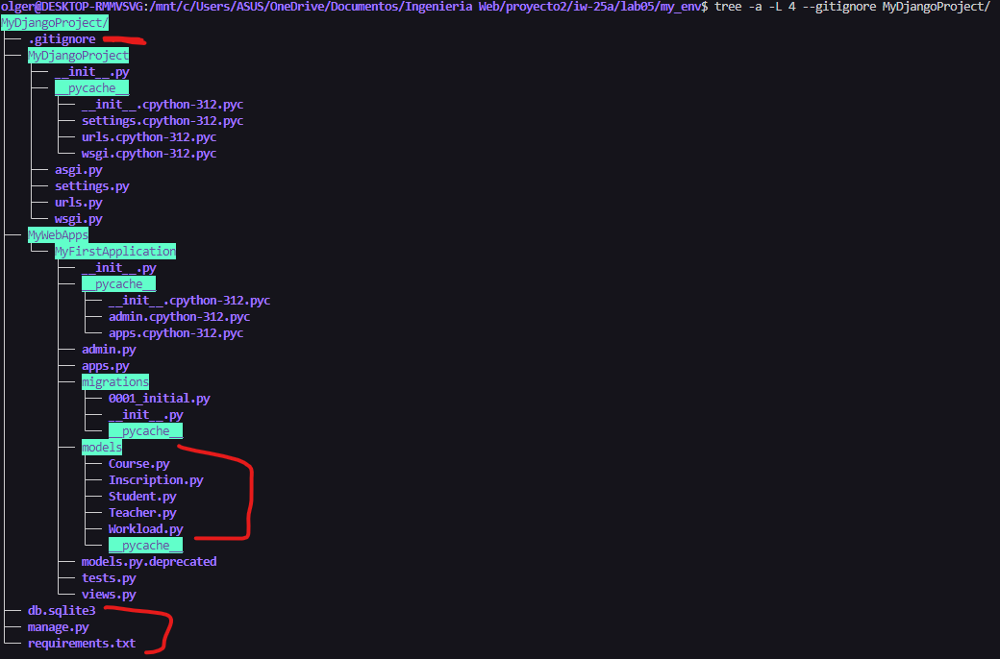
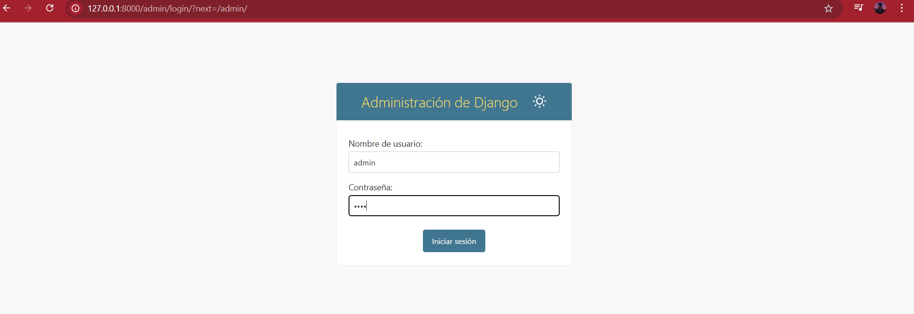
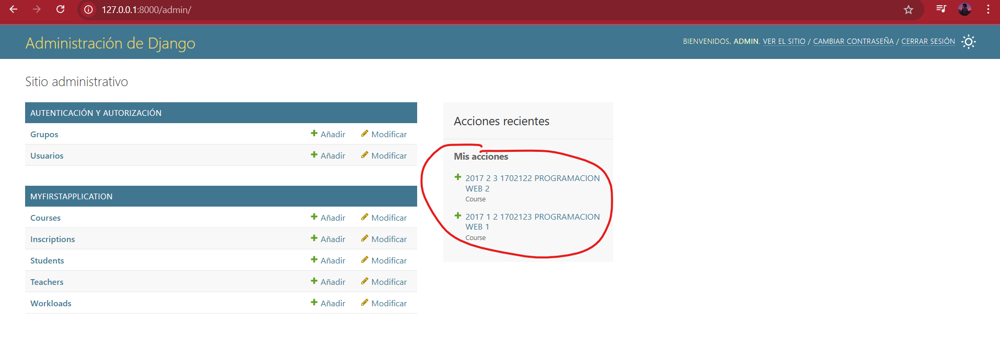

| NOMBRE DEL ALUMNO | Olger Quispe Vilca      | SEMESTRE: 8|
|-------------------|----------------------------------|-----------|
| **CURSO**        | Ingenieria Web |           |
| **DOCENTE**      | Richart Smith Escobedo Quispe      |           |

<span>


</span>

# 🌐Ejemplo de una WebApp: Django Administrador

###### Crear mi entorno virtual en mi carpeta creada [`my_env/`](my_env).

```shells
python -m venv .
```

###### Activar mi entorno virtual en mi carpeta [`lab05/`](lab05).

```shell
.\my_env\Scripts\activate
```

###### En la raiz del proyecto [`MyDjangoProject/`](MyDjangoProject). Ejecutar migraciones:

```shell
python manage.py migrate
```

###### Levantar el servidor

En la carpeta de [`MyDjangoProject/`](MyDjangoProject). Ejecutar el servidor:

```shell
python manage.py runserver
```

###### Acceda desde su navegador web a esta direccion:

```
http://127.0.0.1:8000/admin/
```


Si tiene problemas de origen, seleccionar el interprete de python del entorno virtual en la carpeta de Script. [Django - could not be resolved from source in VS Code](https://stackoverflow.com/questions/67586182/how-to-resolve-import-django-contrib-could-not-be-resolved-from-source-in-vs)

###### Estructura del proyecto ejecutando el comando usando la WSL de Ubunte en VS Code:

```shell
tree -a -L 4 --gitignore MyDjangoProject/
```



###### Inicio de sesion como administrador



###### Creando dos cursos: Programacion Web 1 y Programacion Web 2




© 2025 Olger Quispe Vilca